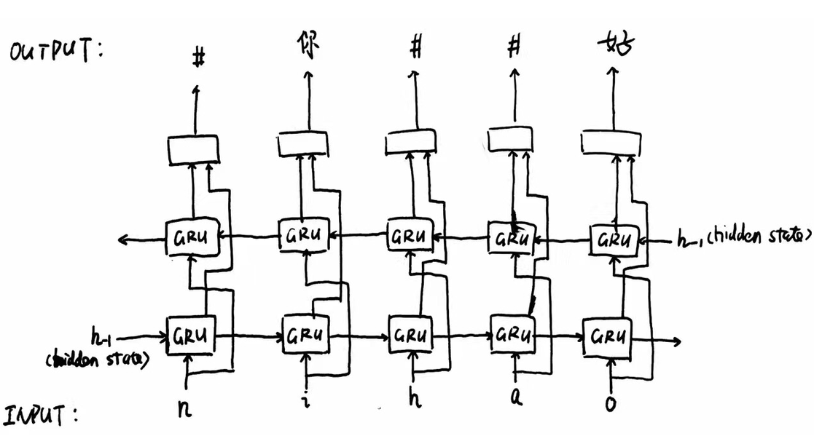

## Gated RNN for End-to-End Translation of Chinese Phonetic Letters to Characters

### Architecture 

Bi-GRU.

The input is a sequence of romanized phonetic letters, and the output is a sequence of Chinese characters. 
For example, the input is ```womenyouxinxinyingdezhecibisai```, and the output should be ```我们有信心赢得这次比赛```("we have confidence to win the game").



### Pipeline
setup_corpus.py
-->
handle_rare_words.py
-->
label_corpus.py
-->
align_corpus.py
-->
calc_vocab.py & format_dataset.py
-->
pinyin_to_hanzi_bigru.py

### Experiments

Error rate is measured by the number of edits divided by the number of Chinese characters, averaged for all the testing sentences.

The models were trained on 67,000 ```(phonetic letters, Chinese sentences)``` pairs.

|                | #test sentences | #hidden nodes | error rate |
|----------------|-----------------|---------------|------------|
| single-way GRU | 1,687           | 256           | 33.38%     |
| Bi-GRU         | 1,687           | 256           | 13.72%     |

### Examples
input: womenyouxinxinyingdezhecibisai

output: 我们有信心赢得这次比赛

input: youyujingyanbuzu

output: 由于经验不足

input: tebieshizuijin_nianlai

output: 特别是最近_年来
